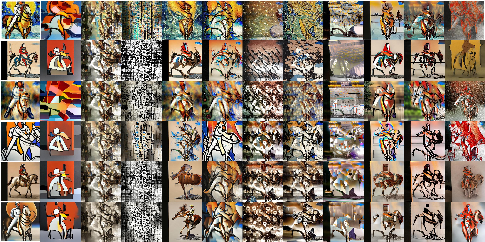
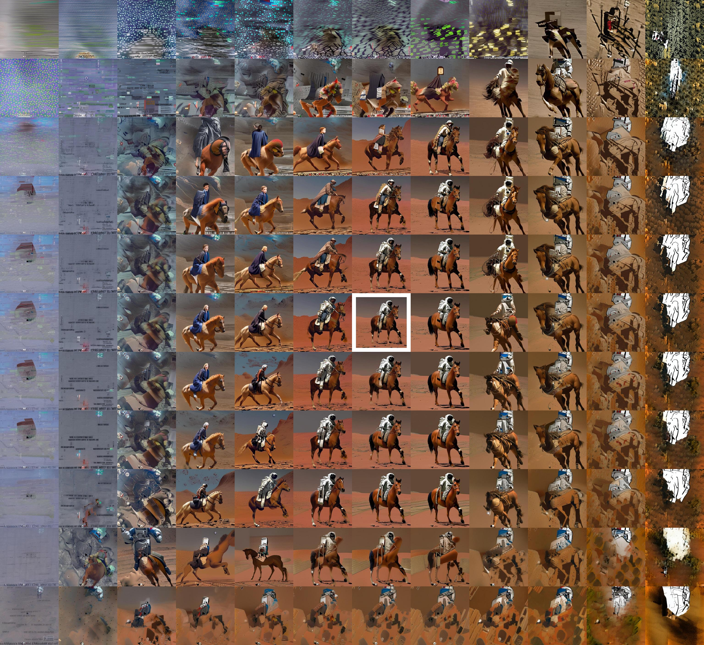

<div align="center">
<h1>AttnMod</h1>
<h4>Attention-Based New Art Styles</h4>

[**Shih-Chieh Su**](https://www.linkedin.com/in/jessysu/)


<a href='https://attnmod.github.io/'></a>
<a href='https://arxiv.org/abs/2409.10028'></a>

</div>

In the above image, the leftmost column shows the default diffuser output of 6 prompted styles. AttnMod creates other styles - each remaining column has the same AttnMod setup. AttnMod modifies the cross attention from the encoded text prompt inside the UNet attention blocks. Within one attention block, different setup twists the diffusion into different tile in the image below, surrounding the highlighted default outut.

<p align="center">
  
</p>

The AttnMod setup contains two parts: starting attention and increment. The default out has starting attention 1 and increment of 0. In the image above, the starting attention goes up toward the right while the increment goes up toward the bottom, when modding only the attention block 'up_blocks.1.attentions.0.transformer_blocks.0.attn2.processor' of SD15.

## Download

```
pip install diffusers==0.30.2
git clone https://github.com/jessysu/attnmod
cd attnmod
```

## Usage

```python
import torch
from attnmod import AttnModXLPipeline

pipe = AttnModXLPipeline.from_pretrained(
    "stabilityai/stable-diffusion-xl-base-1.0", torch_dtype=torch.float16
)
pipe = pipe.to("cuda")
prompt = "a photo of an astronaut riding a horse on mars"

# original output
generator = torch.Generator(device="cpu").manual_seed(0)
image = pipe(prompt, generator=generator).images
image[0]
```

```python
# attnmod
attnmod = {
    'up_blocks.0.attentions.0.transformer_blocks.8.attn1.processor': {
        "start": -50,
        "increment": 0
    },
}
generator = torch.Generator(device="cpu").manual_seed(0)
image = pipe(prompt, generator=generator, attnmod=attnmod,).images
image[0]
```

## Notes
- Individual pipelines for SD and SDXL
- Most (if not all) StableDiffusionPipeline and StableDiffusionXLPipeline features inherited
- Attention modding only happens on the cross attention from the text prompt
