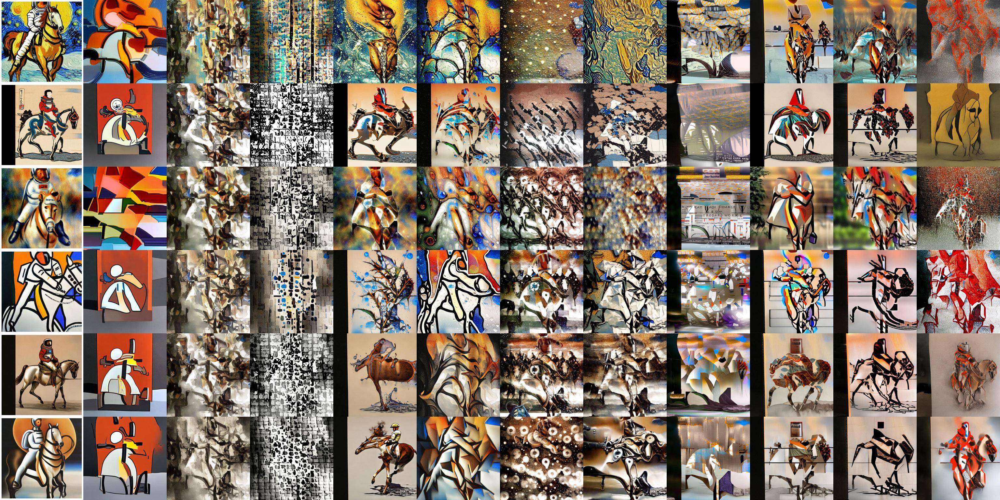

<div align="center">
<h1>AttnMod</h1>
<h4>Attention-Based New Art Styles</h4>

[**Shih-Chieh Su**](https://www.linkedin.com/in/jessysu/)


<a href='https://attnmod.github.io/'></a>
<a href='https://arxiv.org/abs/2409.10028'></a>

</div>

Imagine a human artist looking at the generated photo of a diffusion model, and hoping to create a painting out of it. There could be some feature of the object in the photo that the artist wants to emphasize, some color to disperse, some silhouette to twist, or some part of the scene to be materialized. These intentions can be viewed as the modification of the cross attention from the text prompt onto UNet, during the desoising diffusion.

In the above image, the leftmost column shows the default diffuser output of 6 prompted styles. AttnMod creates other styles - each remaining column has the same AttnMod setup. Within one attention block, different setup twists the diffusion into different tile in the image below, surrounding the default outut.

<p align="center">
  
</p>

## Download

```
git clone https://github.com/jessysu/attnmod
cd attnmod
```

## Usage

```python
import torch
from attnmod import AttnModXLPipeline

pipe = AttnModXLPipeline.from_pretrained(
    "stabilityai/stable-diffusion-xl-base-1.0", torch_dtype=torch.float16
)
pipe = pipe.to("cuda")
prompt = "a photo of an astronaut riding a horse on mars"

# original output
generator = torch.Generator(device="cpu").manual_seed(0)
image = pipe(prompt, generator=generator).images
image[0]
```

```python
# attnmod
attnmod = {
    'up_blocks.0.attentions.0.transformer_blocks.8.attn1.processor': {"start": -50, "increment": 0},
}
generator = torch.Generator(device="cpu").manual_seed(0)
image = pipe(prompt, generator=generator, attnmod=attnmod,).images
image[0]
```

## Notes
- Individual pipelines for SD and SDXL
- Most (if not all) StableDiffusionPipeline and StableDiffusionXLPipeline features inherited
- Attention modding only happens on the cross attention from the text prompt
